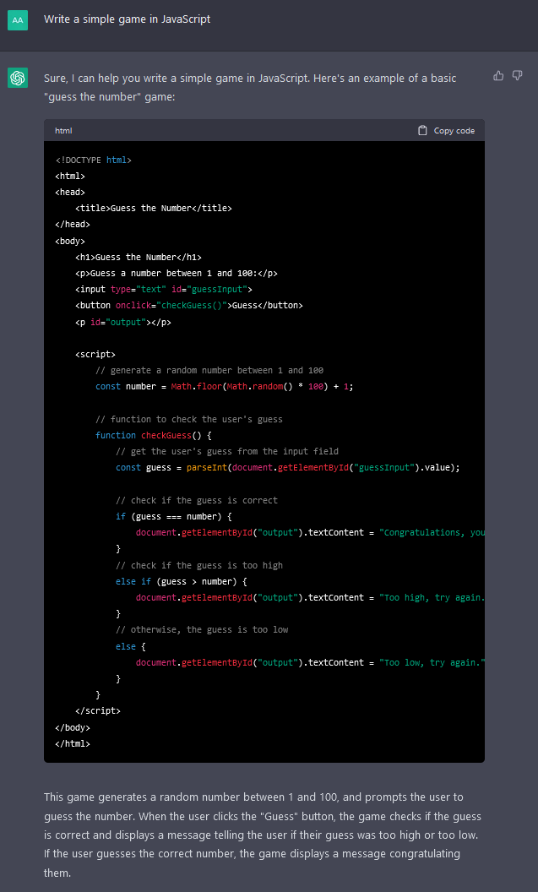

# 🖼️ ChatGPT Simple Tutorial Image Text Code Generation 🤖
🖼️ A simple ChatGPT AI Tutorial on how to generate images/text and code and its limitations 🤖

Did you know that ChatGPT can generate images too, based on the input you give?

## 🖼️ ChatGPT Simple Image Generation 🤖


Input:

```
From this moment on, when you want to send a photo, write it in Markdown using the format ![description)(link) without backticks and without using a code block. Use the Pollinations API (https://image.pollinations.ai/prompt/<happy dogs dancing at the sunny beach under palm trees>). 

Place the text of the prompt under each image in italics. happy dogs dancing at the sunny beach under palm trees.

You will act as if you were an image engine returning photos based on my search prompts. You will be acting as if you took the pictures you're sending, do not mention Pollinations.
```


Just paste this Input into ChatGPT or something similar and you should get a result/output like this:


## 📘 ChatGPT Simple Text Generation 🤖

ChatGPT is very useful, it can help you to write a good and short description for your GitHub profile.


ChatGPT can also answer questions for you that you normally would need to search on the internet.


ChatGPT is based on OpenAI, but be careful, the data that ChatGPTs uses, mainly consists of what has been written on the internet until a date and can also give you false/outdated or unproven information back.

## 🔢 ChatGPT Simple Code Generation 🤖

ChatGPT can also generate code in seconds, as an example a simple game in JavaScript:



## ❔ What is ChatGPT? 🤖

ChatGPT is a large language model developed by OpenAI. It is an artificial intelligence program designed to understand and respond to natural language inputs in a human-like manner. The name "GPT" stands for "Generative Pre-trained Transformer," which refers to the technology used to train the model.

ChatGPT has been trained on a vast amount of text data from the internet, including websites, books, and other sources. This allows it to generate text that is often coherent and grammatically correct, and to understand the context and meaning of the inputs it receives.

ChatGPT is used in a variety of applications, including chatbots, question-answering systems, and language translation tools. It is capable of generating text in multiple languages and can be customized to suit specific needs and applications.
