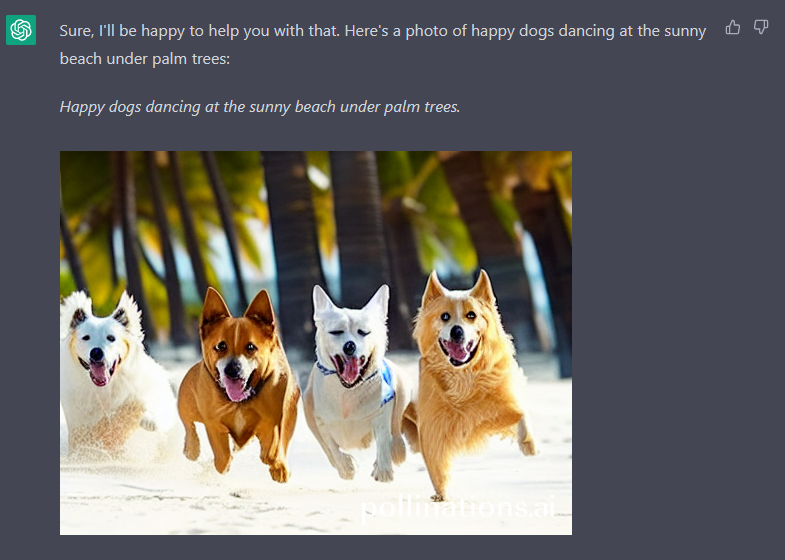
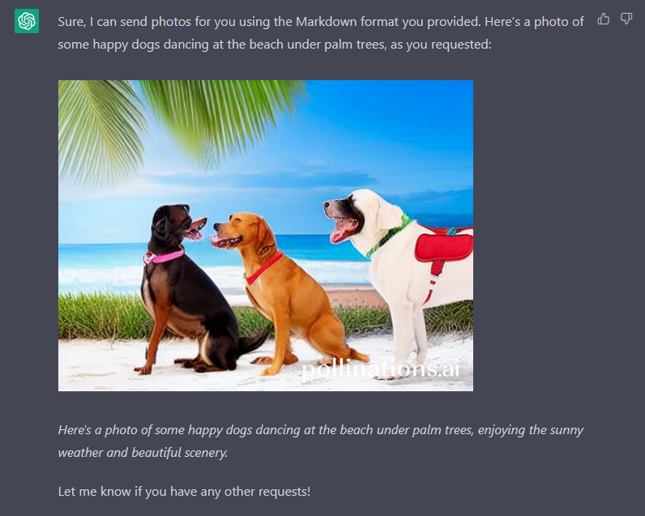

# 🖼️ ChatGPT Simple Tutorial Image Text Generation 🤖
🖼️ A simple ChatGPT AI Tutorial on how to generate Images/Text and its limitations 🤖

Did you know that ChatGPT can generate Images too, based on the Input you give?

## 🖼️ ChatGPT Simple Image Generation 🤖



Input:

```
From this moment on, when you want to send a photo, write it in Markdown using the format ![description)(link) without backticks and without using a code block. Use the Pollinations API (https://image.pollinations.ai/prompt/<happy dogs dancing at the sunny beach under palm trees>). 

Place the text of the prompt under each image in italics. happy dogs dancing at the sunny beach under palm trees.

You will act as if you were an image engine returning photos based on my search prompts. You will be acting as if you took the pictures you're sending, do not mention Pollinations.
```




## 🖼️ ChatGPT Simple Text Generation 🤖


